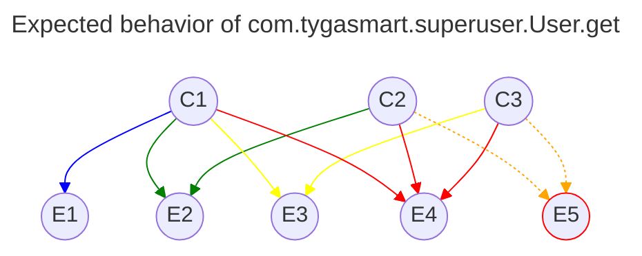
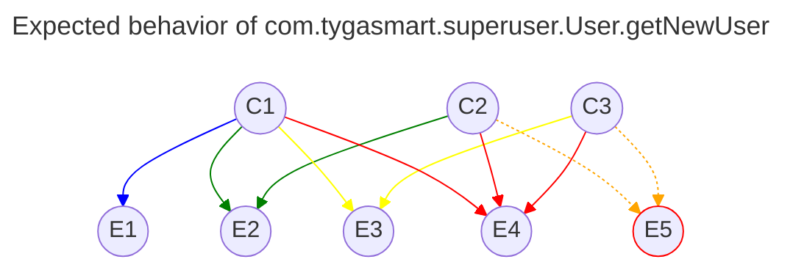

# Testing for superuser

The superuser package contains three services with the following public procedures:

- **Organization**
  - ```get```
- **SignUpApproval**
  - ```setPermission```
- **User**
  - ```authorize```
  - ```get```
  - ```getNewUsers```

## Organization service
### ```com.tygasmart.superuser.Organization.get```
#### Conditions:
- C1: 
#### Expected outputs:
- E1:

## SignUpApproval service

### ```com.tygasmart.superuser.SignUpApproval.setPermission```
#### Conditions:
- C1: 
#### Expected outputs:
- E1:

## User service

### ```com.tygasmart.superuser.User.authorize```
#### Conditions:
- C1: 
#### Expected outputs:
- E1:

### ```com.tygasmart.superuser.User.get```

#### Successful return 
```json
{
  "status": {
    "code": 0,
    "title": "SUCCESS",
    "message": "Process is valid"
  },
  "data": [
    {
      "clientRequested": Boolean,
      "moverRequested": Boolean,
      "isApproved": Boolean,
      ("approvalDate": DateTime),
      "isRejected": Boolean,
      ("rejectionDate": DateTime),
      "isPending": Boolean,
      "isEmailVerified": Boolean,
      "submitDate": DateTime,
      "organizationId": String,
      "userId": String,
      "email": String,
      "firstName": String,
      "lastName": String,
      "imageUrl": String,
    }
  ]
}
```

#### Conditions:
- C1: The request is made by a _superuser_ user.
- C2: The procedure receives any of _```userId```_, _```email```_, _```client```_, _```mover```_, _```approved```_, _```rejected```_, _```pending```_ or a combination of any of them as parameters.
- C3: The procedure receives a _```limit```_ and a _```page```_ as parameters.
  
#### Expected outputs:
- E1: A list of all new requests with user information from the **_AdminRequest_** and **_User_** types.
- E2: A filtered list of requests with user information from the **_AdminRequest_** and **_User_** types.
- E3: A list of all new users limited to _```limit```_ number of records from the _```page```_ page of the **_AdminRequest_** type with a pending status.
- E4: A filtered list of new users limited to _```limit```_ number of records from the _```page```_ page of the **_AdminRequest_** type with a pending status.
- E5: An ```Unauthorized Request``` exception.




### ```com.tygasmart.superuser.User.getNewUser```
#### Successful return

```json
{
  "status": {
    "code": 0,
    "title": "SUCCESS",
    "message": "Process is valid"
  },
  "data": [
    {
      "clientRequested": Boolean,
      "moverRequested": Boolean,
      "isPending": Boolean,
      "isEmailVerified": Boolean,
      "submitDate": DateTime,
      "organizationId": String,
      "userId": String,
      "email": String,
      "firstName": String,
      "lastName": String
    }
  ]
}
```

#### Conditions: 
- C1: The request is made by a _superuser_ user.
- C2: The procedure receives any of _```userId```_, _```email```_ or both as parameters.
- C3: The procedure receives a _```limit```_ and a _```page```_ as paramters.

#### Expected outputs:
- E1: A list of all new requests with requester information from the **_AdminRequest_** and **_User_** types with a pending status.
- E2: A filtered list of new requests with requester information from the **_AdminRequest_** and **_User_** types with a pending status.
- E3: A list of all new requests with requester information limited to a _```limit```_ number of records of the _```page```_ page from the **_AdminRequest_** and **_User_** types with a pending status.
- E4: A filtered list of new requests with requester information limited to a _```limit```_ number of records of the _```page```_ page from the **_AdminRequest_** and **_User_** types with a pending status.
- E5: An ```Unauthorized_Request``` exception.

